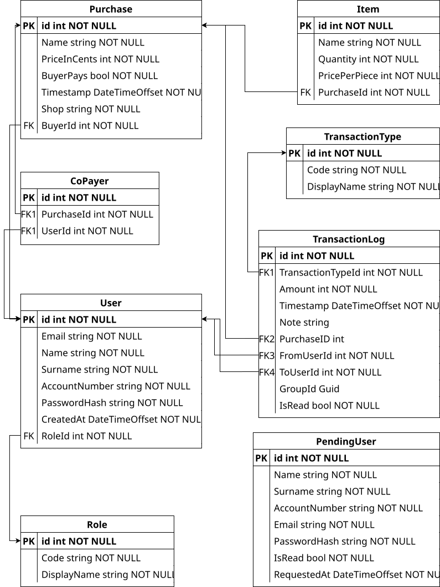

# Platbík

**Autor:** Danneschs

Webová aplikace pro správu společných nákupů a vyrovnávání dluhů mezi uživateli.

## O aplikaci

Platbík je webová aplikace pro evidenci a správu společných nákupů ve skupině lidí (např. spolubydlící, přátelé, rodina). Aplikace umožňuje zaznamenávat nákupy, automaticky počítat dluhy mezi uživateli a spravovat jejich vyrovnání.

Aplikace je postavená na [Material UI](https://mui.com/) a [Emotion](https://emotion.sh/).

### Vznik
Návrh frontendu této aplikace vznikl jako semestrální práce na **Fakultě aplikovaných věd Západočeské univerzity v Plzni** z předmětu Úvod do uživatelských rozhraní (KIV/UUR). Backend byl později dokončen jako semestrální práce z předmětu Základy počítačových sítí (KIV/ZPS) a na aplikaci je dále pracováno v rámci osobního použití.

### Hlavní funkce

- **Evidence nákupů** — zaznamenávání nákupů s detaily (položky, cena, obchod),
- **Správa spoluplatitelů** — určení, kdo se na nákupu podílel,
- **Automatický výpočet dluhů** — systém automaticky počítá, kdo komu dluží,
- **Závazkové vztahy** — přehled dluhů mezi uživateli,
- **Historie transakcí** — kompletní historie všech nákupů a vyrovnání,
- **Notifikace** — upozornění na nové transakce,
- **Podpora více měn** — nastavitelná měna přes konfiguraci (CZK, EUR).

---

## Technologie

### Backend (C#/.NET)
| Technologie | Verze |
|---|---|
| ASP.NET Core | 10.0 |
| Entity Framework Core | 9.0.6 |
| JWT autentizace | 8.0.17 |
| SQLite | 9.0.6 |

### Frontend
| Technologie | Verze |
|---|---|
| React | 19 |
| Material-UI (MUI) | 7 |
| MUI X Data Grid | 7 |
| React Router | 7 |
| Zustand | 5 |
| Vite | 6 |
| **@danneschs/libnik-ui** | **0.1.0** |

Frontend využívá sdílenou komponentovou knihovnu **[@danneschs/libnik-ui](https://github.com/Danneschs/libnik-ui)**, která obsahuje obecné UI komponenty (dialogy, tabulky, formuláře, rozložení stránky) opakovaně použitelné napříč projekty. 

---

## Struktura projektu

```
platbik/
├── src/
│   ├── backend/                  # Backend C#/.NET
│   │   ├── Controllers/          # API endpointy
│   │   ├── Models/               # Datové modely
│   │   ├── Services/             # Business logika
│   │   ├── DTOs/                 # Data Transfer Objects
│   │   ├── Middleware/           # Middleware komponenty
│   │   └── Data/                 # Databázový kontext a SQLite soubor
│   └── frontend/                 # React aplikace (Vite)
│       └── src/
│           ├── Main.jsx          # Vstupní bod, ThemeProvider + BrowserRouter
│           ├── App.jsx           # Definice routes
│           ├── Grid.jsx          # Obal stránky (autentizace, navigace, dialogy)
│           ├── theme.js          # MUI theme projektu (barvy, paleta)
│           ├── styles/           # Globální CSS (výška html/body/#root)
│           ├── api/              # Komunikace s backendem (fetch funkce)
│           │   └── wrappers/     # Pomocné obalové funkce
│           ├── auth/             # Autentizační kontext a komponenty
│           │   ├── AuthContext.js
│           │   ├── AuthProvider.jsx
│           │   └── FullPageSpinner.jsx
│           ├── config/           # Konfigurace měny (kontext)
│           ├── bookmarks/        # Stránky aplikace
│           │   ├── AllPurchases.jsx
│           │   ├── MyPurchases.jsx
│           │   ├── MyCommitments.jsx
│           │   ├── Auth.jsx
│           │   ├── About.jsx
│           │   └── NotLogged.jsx
│           ├── components/
│           │   ├── dialogs/      # Aplikační dialogy
│           │   │   ├── EditPurchaseDialog.jsx
│           │   │   ├── DebtorDetailDialog.jsx
│           │   │   ├── NotificationsDialog.jsx
│           │   │   ├── PayDialog.jsx
│           │   │   └── RegistrationRequestsDialog.jsx
│           │   └── columns/      # Definice sloupců pro DataGrid
│           │       ├── getPurchaseColumns.jsx
│           │       ├── getCommitmentColumns.jsx
│           │       ├── getItemColumns.jsx
│           │       ├── getTransactionColumns.jsx
│           │       ├── EditCellWithTooltip.jsx
│           │       └── widths/ColumnWidths.js
│           ├── mappers/          # Transformace dat z API
│           └── objects/          # DTO a doménové objekty
└── model/                        # Databázový ER diagram
```

---

## Instalace a spuštění

### Požadavky

- .NET SDK 10.0 (pro backend)
- Node.js a npm (pro frontend)

### Backend (C#)

```bash
cd src/backend

# Nastavení JWT klíče jako environment variable
export JWT__Key="váš-tajný-klíč"

# Volitelně: nastavení měny (základní je CZK)
export CURRENCY_CODE="CZK"

# Aktualizace databáze
dotnet ef database update

# Spuštění
dotnet run
```

Backend běží standardně na `http://localhost:5000` nebo `https://localhost:5001`.

### Frontend

```bash
cd src/frontend

# Instalace závislostí
npm install

# Vývojový server
npm run dev

# Nebo build pro produkci
npm run build
```

Frontend běží standardně na `http://localhost:5173`.

---

## Konfigurace

### Environment proměnné (pro backend)

| Proměnná | Povinná | Popis |
|---|---|---|
| `JWT__Key` | ano | Tajný klíč pro podepisování JWT tokenů |
| `CURRENCY_CODE` | ne | Kód měny (`"CZK"`, `"EUR"`), výchozí `"CZK"` |

### Barvy a vzhled

Barvy aplikace jsou definovány v `src/frontend/src/theme.js` jako MUI theme. Změnou hodnot v tomto souboru se upraví vzhled celé aplikace — komponenty z `@danneschs/libnik-ui` čtou barvy z `ThemeProvider` tohoto projektu, takže reagují na nastavené téma stejně jako ostatní MUI komponenty.

---

## API Endpointy

### Autentizace
- `POST /api/auth/register` — registrace nového uživatele
- `POST /api/auth/login` — přihlášení uživatele

### Uživatelé
- `GET /api/users` — seznam všech uživatelů
- `GET /api/users/{id}` — detail uživatele
- `PUT /api/users/{id}` — aktualizace uživatele
- `DELETE /api/users/{id}` — smazání uživatele

### Nákupy
- `GET /api/purchases` — seznam všech nákupů
- `GET /api/purchases/{id}` — detail nákupu
- `POST /api/purchases` — vytvoření nového nákupu
- `PUT /api/purchases/{id}` — aktualizace nákupu
- `DELETE /api/purchases/{id}` — smazání nákupu

### Závazkové vztahy
- `GET /api/commitments` — přehled dluhů mezi uživateli

### Transakce
- `GET /api/transaction-logs` — historie transakcí
- `POST /api/transaction-logs` — vytvoření nové transakce

### Konfigurace
- `GET /api/config` — globální konfigurace aplikace
- `GET /api/exchange-rates` — aktuální směnné kurzy

---

## Databázový model

